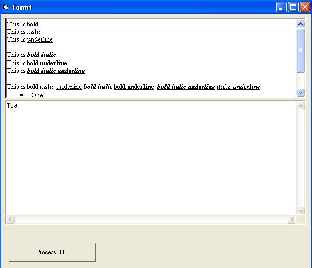



## RTF2HTML

### Description

This will convert Bold, Underline, Italic, and Bulleted RTF text into HTML.
 
### More Info
 
This code is well commented so it should be easy to follow. It should also be easy for someone to take this code as a starting off point, and make a full RTF to HTML converter.

             |
---                |---
**Submitted On**   |2002-06-05 17:00:28
**By**             |[Charlie  A Quante](https://github.com/Planet-Source-Code/PSCIndex/blob/master/ByAuthor/charlie-a-quante.md)
**Level**          |Intermediate
**User Rating**    |5.0 (10 globes from 2 users)
**Compatibility**  |VB 5\.0, VB 6\.0
**Category**       |[Internet/ HTML](https://github.com/Planet-Source-Code/PSCIndex/blob/master/ByCategory/internet-html__1-34.md)
**World**          |[Visual Basic](https://github.com/Planet-Source-Code/PSCIndex/blob/master/ByWorld/visual-basic.md)
**Archive File**   |[RTF2HTML90748652002\.zip](https://github.com/Planet-Source-Code/charlie-a-quante-rtf2html__1-35511/archive/master.zip)

